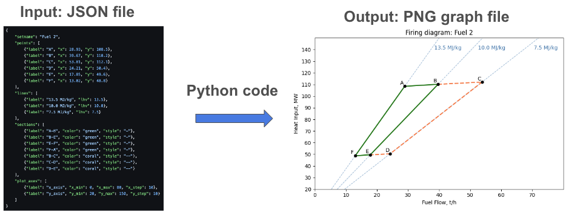

# Firing diagram

## General

A simple tool used for creation of a firing diagram for a boiler. A firing diagram presents a graph that links fuel consumption and heat input required for a boiler operation. It shows a region covered by a boiler operation range that is bounded by fuel heating value and boiler operation load ranges.

Elements that compose a firing diagram:
- Point - a specific boiler load point representaition
- Line - presenting heat input for a given fuel heating value
- Section - connects two boiler load points to bound a given operational range





The project code can be altered to provide other types of graphs, depending on a particuliar demands.

## Technologies used

Python, matplotlib, numpy

## Installation and running

1. Clone the project
    ```bash
    git clone https://github.com/pawelkozolub/firing-diagram.git
    ```
2. Go to project directory
    ```bash
    cd firing-diagram
    ```
3. Run the main file
    ```bash
    python src/main.py
    ```
**Note:**\
Prior to running it may be needed to install required Python libraries. Please check `requirements.txt` file.


## Author

[@ Pawel Kozolub](https://github.com/pawelkozolub)